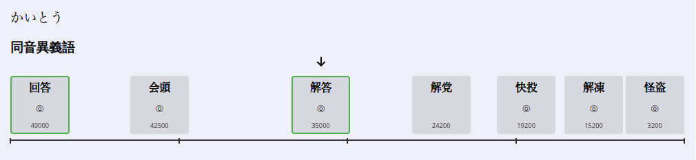
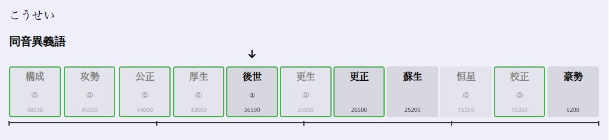

# Jaydar

A Rust library for finding **J**apanese **homo**phones and ranking them by frequency using the JMDict dictionary, with optional NHK pitch accent data to distinguish true homophones from "fake" homophones (same reading, different pitch).






## Features

- Find all homophones (words with the same pronunciation) for a given Japanese word
- Rank homophones by frequency based on multiple corpora
- Support for kanji, hiragana, and **katakana** input (ソーセージ and 双生児 are homophones)
- Identify common vs uncommon words
- Distinguish true homophones from "fake" homophones using NHK pitch accent data
- Categorize results based on input type (unique word, reading, or no homophones)
- Automatic katakana-to-hiragana conversion for searches

## Usage

### Basic usage (without pitch accent)

```rust
use jaydar::find;

let homophones = find("かう");
for word in homophones {
    println!("{} ({}) - frequency: {}, common: {}", 
        word.text, 
        word.reading, 
        word.frequency_score,
        word.is_common
    );
}
```

### With NHK pitch accent data

```rust
use jaydar::{find_with_nhk, FindWithNhkResult};

let result = find_with_nhk("構成");
match result {
    FindWithNhkResult::NoHomophones => {
        println!("This word has no homophones");
    }
    FindWithNhkResult::UniqueMatch { true_homophones, different_pitch_homophones } => {
        println!("True homophones (same pitch):");
        for word in &true_homophones {
            println!("  {} - pitch: {:?}", word.text, word.pitch_accent);
        }
        
        println!("Fake homophones (different pitch):");
        for word in &different_pitch_homophones {
            println!("  {} - pitch: {:?}", word.text, word.pitch_accent);
        }
    }
    FindWithNhkResult::MultipleMatches { homophones } => {
        println!("Multiple matches found:");
        for word in &homophones {
            println!("  {} - pitch: {:?}", word.text, word.pitch_accent);
        }
    }
}
```

When searching for "構成" (pitch 0), words like "後世" (pitch 1) will be categorized as different pitch homophones.

Example with multiple pitch accents:
```rust
let result = find_with_nhk("ていど");
// 程度 will have pitch_accent: vec![1, 0] - both pronunciations are valid
```

### Katakana support

```rust
use jaydar::find;

// Searching with katakana automatically finds hiragana/kanji homophones
let homophones = find("カイ");
// Returns: 買い, 下位, 階, 回, 貝, 会, etc.

// Works with any katakana input
let homophones = find("コウセイ");
// Returns: 構成, 攻勢, 公正, 厚生, 後世, etc.
```

## Frequency Scoring

The frequency score is calculated based on:

1. **Frequency bucket** (1-48): Words in bucket 1 are the 500 most common words
2. **News corpus**: Appearance in Mainichi Shimbun newspaper
3. **Ichimango**: Presence in the "10,000 word vocabulary classification" book
4. **Loanwords**: Common loanword status
5. **Additional**: Other common word indicators

Higher scores indicate more common words.

## Key Concepts

### Result Categories

The `find_with_nhk` function returns three possible result types:

1. **NoHomophones**: The word exists but has no other words with the same reading
   - Example: 中国語, タピオカ, 前置き

2. **UniqueMatch**: A specific word was searched (kanji/katakana), showing:
   - **true_homophones**: Words with the same reading AND pitch accent (e.g., 構成[0] and 公正[0])
   - **different_pitch_homophones**: Words with the same reading but different pitch accent (e.g., 構成[0] and 後世[1])

3. **MultipleMatches**: A reading was searched (typically hiragana), returning all words with that reading
   - Example: Searching for "こうせい" returns all words pronounced that way

Note: Many Japanese words have multiple accepted pitch accents. For example, 程度 can be pronounced with either pitch accent 1 or 0. The library stores all accepted pitch accents in order of preference (most mainstream first).

### Frequency Ranking

The library correctly ranks common words higher than uncommon ones:
- 構成 (48,000) > 後世 (36,500)
- 家庭 (50,000) > 課程 (41,000)
- 橋 (46,000) > 箸 (32,000)

## Examples

Running the basic demo:

```bash
cargo run --example demo
```

Running the demo with pitch accent:

```bash
cargo run --example demo_with_pitch
```

Running the katakana demo:

```bash
cargo run --example katakana_demo
```

Testing specific cases:

```bash
cargo run --example test_cases
```

## API Reference

### Types

```rust
pub struct WordFrequency {
    pub text: String,           // The word (kanji/kana)
    pub reading: String,        // Reading in hiragana
    pub frequency_score: u32,   // Higher = more common
    pub is_common: bool,        // Marked as common in JMDict
}

pub struct WordFrequencyWithPitch {
    pub text: String,
    pub reading: String,
    pub frequency_score: u32,
    pub is_common: bool,
    pub pitch_accent: Vec<u8>,  // Multiple pitch accents in order of preference
}

pub enum FindWithNhkResult {
    NoHomophones,                        // Word has no homophones
    UniqueMatch {                        // Specific word was searched
        true_homophones: Vec<WordFrequencyWithPitch>,      // Same pitch
        different_pitch_homophones: Vec<WordFrequencyWithPitch>, // Different pitch
    },
    MultipleMatches {                    // Reading was searched
        homophones: Vec<WordFrequencyWithPitch>,
    },
}
```

### Functions

```rust
// Find homophones without pitch accent data
pub fn find(word: &str) -> Vec<WordFrequency>

// Find homophones with pitch accent data
pub fn find_with_nhk(word: &str) -> FindWithNhkResult
```

## License

Note: This library uses the JMDict database which is licensed from the Electronic Dictionary Research and Development Group under Creative Commons licenses. Applications using this library must display appropriate copyright notices.

The NHK pitch accent data is derived from NHK日本語発音アクセント辞典.
